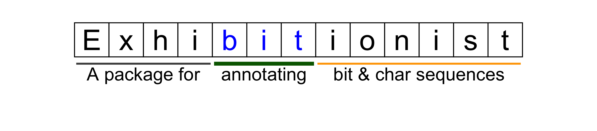

<!-- README.md is generated from README.Rmd. Please edit that file -->

```{r, include = FALSE}
knitr::opts_chunk$set(
  collapse = TRUE,
  comment = "#>",
  fig.path = "man/figures/README-",
  out.width = "100%",
  fig.width  = 9,
  fig.height = 2
)

suppressPackageStartupMessages({
  library(ggplot2)
  library(dplyr)
  library(exhibitionist)
})
```
# 

<!-- badges: start -->

<!-- badges: end -->

The `exhibitionist` package provides functions for showing and annotating sequences of
characters or numbers.

## What's in the box

* `show_bit()` for showing bit sequences of integers and doubles in the console
* `plot_char()` for plotting a sequence of characters as defined in a `chars_df` data.frame
  with an `annotation_df` data.frame used to control the annotation underneat the characters.

## Installation

You can install from [GitHub](https://github.com/coolbutuseless/exhibitionist) with:

``` r
# install.packages("devtools")
devtools::install_github("coolbutuseless/exhibitionist")
```

# `show_bit()` for displaying integers and doubles in the terminal

```{r}
show_bits(12345.67)
```


```{r}
show_bits(12345L)
```


# Built in annotation for 'doubles'

```{r fig.height = 1}
plot_double(1.2345e87)
```


```{r}
plot_compact_double(1.2345e87, base_size = 5, legend.text.multiplier = 2)
```


# Some miscellaneous examples

```{r echo = FALSE, fig.height = 3}
chars_df <- tibble(
  char = strsplit("867-5309", '')[[1]],
  x    = seq_along(char)
)

annotation_df <- tribble(
  ~start, ~end, ~text, ~segment,               ~label, ~segment_colour, ~segment_size, 
       1,    3,  TRUE,     TRUE,              "Jenny", 'darkgreen'    , 2,
       5,    8,  TRUE,    FALSE, "I got your number", 'grey60'       , 2
)


plot_chars(chars_df, annotation_df) + ylim(-2, 1.5)
```


```{r echo = FALSE, fig.height = 3}
chars_df <- tibble(
  char = strsplit("3.1415926535", '')[[1]],
  x    = seq_along(char)
)

chars_df <- chars_df %>%
  mutate(
    tile_fill = if_else(x %in% 5:7, 'red', 'grey80')
  )

annotation_df <- tribble(
  ~start, ~end, ~text, ~segment, ~label, ~segment_colour, ~segment_size, ~text_size, ~text_y,
       5,    7,  TRUE,     TRUE, "Height of Great Pyramid of Giza\n(yards)", 'darkgreen'    , 2, 6, -1.1
)


plot_chars(chars_df, annotation_df) + ylim(-2, 1.5)
```


# Annotating the word 'exhibitionist' for the header of this page

The header of this page was made with this package.

The two key data.frames are:

* `chars_df` which must include the columns
    * `x` for the the x-coordinate of the character
    * `char` for the character itself
    * and optional styling columns (see below
* `annotation_df` which must include the columns
    * `start`/`end` for the start and end of a line segment underneath the tiles
    * `segment`/`text` logical values which indicate whether the segment and text
      should be drawn
    * and optional styling columns (see below)

Styling columns: 

* variables prefixed with `text_` are passed to `geom_text()`
* variables prefixed with `segment_` are passed to `geom_segment()`
* The characters inside the tiles and the annotations are styled independently.

```{r header, fig.height=2}
#~~~~~~~~~~~~~~~~~~~~~~~~~~~~~~~~~~~~~~~~~~~~~~~~~~~~~~~~~~~~~~~~~~~~~~~~~~~~~~
# Create the characters data.frame
#~~~~~~~~~~~~~~~~~~~~~~~~~~~~~~~~~~~~~~~~~~~~~~~~~~~~~~~~~~~~~~~~~~~~~~~~~~~~~~
chars_df <- tibble(
  char        = strsplit("Exhibitionist", '')[[1]],
  x           = seq_along(char),
  text_colour = 'black'
)

#~~~~~~~~~~~~~~~~~~~~~~~~~~~~~~~~~~~~~~~~~~~~~~~~~~~~~~~~~~~~~~~~~~~~~~~~~~~~~~
# Set the word 'bit' to be BLUE text
#~~~~~~~~~~~~~~~~~~~~~~~~~~~~~~~~~~~~~~~~~~~~~~~~~~~~~~~~~~~~~~~~~~~~~~~~~~~~~~
chars_df$text_colour[5:7] <- 'blue'

#~~~~~~~~~~~~~~~~~~~~~~~~~~~~~~~~~~~~~~~~~~~~~~~~~~~~~~~~~~~~~~~~~~~~~~~~~~~~~~
# How should the individual characters be labelled
#~~~~~~~~~~~~~~~~~~~~~~~~~~~~~~~~~~~~~~~~~~~~~~~~~~~~~~~~~~~~~~~~~~~~~~~~~~~~~~
annotation_df <- readr::read_csv(
"start, end,  segment,  text, text_size, label               , segment_colour, segment_size
     1,   4,    TRUE ,  TRUE,         7, A package for       , grey30        , 1
     5,   7,    TRUE ,  TRUE,         7, annotating          , darkgreen     , 2
     8,  13,    TRUE ,  TRUE,         7, bit & char sequences, orange        , 1
")

plot_chars(chars_df, annotation_df) + ylim(-2, 1.5)
```

```{r echo = FALSE, message = FALSE, warning = FALSE}
ggsave(filename = "man/figures/header.png")
```


# Annotating way too much

This is a demonstration of a lot more options you can change to modify appearance.

In general:

* variables prefixed with `text_` are passed to `geom_text()`
* variables prefixed with `segment_` are passed to `geom_segment()`
* The characters inside the tiles have different styling attributes than the 
   annotations which appear underneath.

```{r too_much, fig.height = 3}
#~~~~~~~~~~~~~~~~~~~~~~~~~~~~~~~~~~~~~~~~~~~~~~~~~~~~~~~~~~~~~~~~~~~~~~~~~~~~~~
# Create the characters data.frame
#~~~~~~~~~~~~~~~~~~~~~~~~~~~~~~~~~~~~~~~~~~~~~~~~~~~~~~~~~~~~~~~~~~~~~~~~~~~~~~
chars_df <- tibble(
  char        = strsplit("Over the top", '')[[1]],
  x           = seq_along(char),
  text_colour = 'black',
  text_size   = 11,
  text_angle  = 0
)

#~~~~~~~~~~~~~~~~~~~~~~~~~~~~~~~~~~~~~~~~~~~~~~~~~~~~~~~~~~~~~~~~~~~~~~~~~~~~~~
# Style a lot of the characters
#~~~~~~~~~~~~~~~~~~~~~~~~~~~~~~~~~~~~~~~~~~~~~~~~~~~~~~~~~~~~~~~~~~~~~~~~~~~~~~
chars_df <- chars_df %>% 
  mutate(
    text_colour = if_else(x %% 2 == 0, 'red', text_colour),
    text_angle  = if_else(x %% 3 == 0,   45 , text_angle ),
    text_size   = if_else(x %% 6 == 0,   28 , text_size  ),
    tile_fill   = if_else(char == ' ', NA_character_, 'white'),
    tile_colour = if_else(char == ' ', NA_character_, 'black')
  )

#~~~~~~~~~~~~~~~~~~~~~~~~~~~~~~~~~~~~~~~~~~~~~~~~~~~~~~~~~~~~~~~~~~~~~~~~~~~~~~
# How should the individual characters be labelled underneath?
#~~~~~~~~~~~~~~~~~~~~~~~~~~~~~~~~~~~~~~~~~~~~~~~~~~~~~~~~~~~~~~~~~~~~~~~~~~~~~~
annotation_df <- readr::read_csv(
"start, end,  segment,  text, text_size, label               , segment_colour, segment_linetype, segment_size, text_family, text_angle, text_hjust
     1,   4,    TRUE ,  TRUE,        10, Over it!!           , darkgreen     , 1               , 1           , serif      , 0         ,  0.5
     6,   8,    TRUE ,  TRUE,         7, Too Much?           , blue          , 2               , 2           ,            , 45        ,  1
    10,  12,    TRUE ,  TRUE,         7, Or not enough??     , orange        , 3               , 4           ,            , 180       ,  0.5
")

plot_chars(chars_df, annotation_df) + 
  ylim(-2, 1.2)
```


